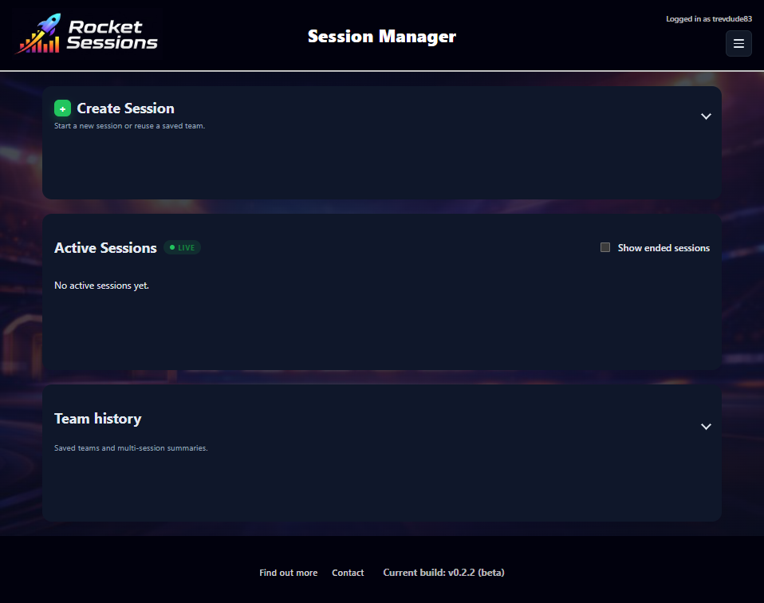
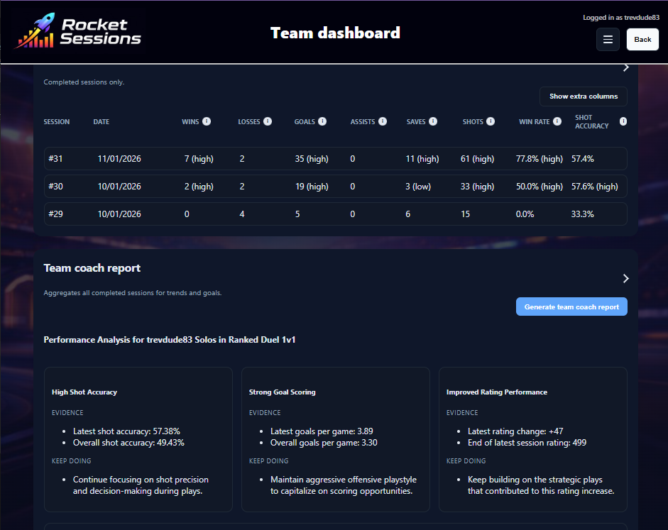

# RocketSessions

A community-built Rocket League session manager focused on helping players review performance over time. This project is a personal, non-commercial tool created to improve the player experience with clear, session-based stats, trends, and coaching insights.

## Community-first intent

This project is built for the Rocket League community and has **no commercial ambitions**. It is an unofficial, fan-made tool intended to help players learn and improve. If you are reviewing access to official Rocket League APIs, please consider this as a community support project that prioritizes transparency and player benefit over monetization.

## Disclaimer

Rocket League is a trademark of Psyonix, LLC. This project is unaffiliated with and not endorsed by Psyonix or Epic Games.

## What it does

- Track Rocket League sessions across competitive modes (solo, 2v2, 3v3, 4v4).
- Capture end-of-match scoreboards and convert them into match stats.
- Store matches locally in SQLite for reliable session history.
- Show per-session deltas and trend charts.
- Support manual baseline snapshots to seed player cards.
- Generate AI Coach reports grounded in the stored metrics.

## Tech stack

- Node.js + TypeScript (server)
- Express (API server)
- SQLite with better-sqlite3 (local persistence)
- React + Vite + TypeScript (client)
- Recharts (charts)

## Data storage note

This project uses a local SQLite database stored on your machine. The database file is created on first run and is **not** included in the repository. If you delete it, the app will recreate a fresh database.

## Screenshots





## Quick start

1) Install dependencies from the repo root:

```bash
npm install
```

2) Configure the player stats API:

This project does not bundle any Rocket League APIs. If you plan to upload manual baseline snapshots, you must supply your own player stats API credentials and endpoint, obtained through official, authorized channels in compliance with Psyonix/Epic policies.

You can set the API key and base URL in System Admin > API settings, or via a `.env` file at the repo root (see `.env.example`).

3) Run the dev servers:

```bash
npm run dev
```

- Server: http://localhost:3001
- Client: http://localhost:5173

## Usage overview

- Create a session for solo or team modes (2v2, 3v3, 4v4) using the relevant gamertags.
- Upload a baseline snapshot per player if you want player cards to show starting values.
- Scoreboard captures create matches and drive the session totals.
- Stop or end a session to retain the stored history.

## User roles and first admin setup

Roles:
- **Admin**: System Admin access, user approvals, and configuration (API keys, base URL, AI settings).
- **User**: Create/manage sessions and view team dashboards (subject to approvals).

Bootstrap the first admin (only if no users exist yet):
1) Set these environment variables before starting the server:

```bash
ADMIN_USERNAME="your_admin_username"
ADMIN_EMAIL="you@example.com"
ADMIN_PASSWORD="your_password"
```

2) Start the server. The first admin account will be created automatically.

After that, admins can approve or manage users from User Admin.

Environment variable loading order:
- `.env` file in the repo root (loaded by `dotenv` on server start).
- System Admin settings saved in the local database (loaded on server start).
- Current shell environment (`$env:VAR` or `set VAR=...`) overrides defaults.

## AI Coach (optional)

Enable AI Coach by setting OpenAI credentials:

```bash
# PowerShell
$env:OPENAI_API_KEY="your_openai_key"
$env:OPENAI_MODEL="gpt-4o-mini"
```

Then run:

```bash
npm run dev
```

Open a session and click "Generate Coach Report" in the AI Coach panel. The server builds a compact coach packet from stored match data (and any baseline snapshots) and the model returns a strict JSON report for the UI.

Prompt tuning:
- You can override the default **Session Coach** prompt and the **Team Coach** prompt separately in System Admin > AI Agent Settings.
- The override replaces the default prompt entirely. Clearing the override reverts to the default.
- You can also update the stored default prompt for each coach type from the same screen.

## ScoreboardCam integration (optional)

RocketSessions can ingest end-of-match scoreboard images captured by a Raspberry Pi (or any device) and convert them into structured match data.

How it works:
- Register a device to receive a one-time device key.
- The device polls for the active session context.
- The device uploads 1-3 scoreboard images after each match.
- The server extracts stats with OpenAI Vision and adds a match to the active session.

Key endpoints:
- `POST /api/v1/scoreboard/devices/register` -> returns `{ deviceId, deviceKey, pollUrl, uploadUrl }`
- `GET /api/v1/scoreboard/devices/:deviceId/context` (Header: `X-Device-Key: <deviceKey>`)
- `GET /api/v1/scoreboard/devices/:deviceId/status` (Header: `X-Device-Key: <deviceKey>`)
- `POST /api/v1/scoreboard/ingest` (Header: `X-Device-Key: <deviceKey>`, multipart `images[]`)
- `POST /api/v1/scoreboard/ingest/:ingestId/process` (Header: `X-Device-Key: <deviceKey>`)

Notes:
- The Pi only uploads images. All extraction, mapping, and aggregation happen server-side.
- Dedupe is applied so repeated captures of the same scoreboard do not create duplicate matches.
- If OpenAI is not configured, the extractor returns a stub payload and the ingest will fail gracefully.
- Optional: set `OPENAI_VISION_MODEL` if you want a different model for images.
- You can view devices, ingests, and retention settings in System Admin > ScoreboardCam.
- Cleanup runs automatically based on the configured retention window.

## Demo

Create a demo session quickly:

```bash
# POST http://localhost:3001/api/demo
```

## Known limitations

- AI Coach guidance is based on statistical aggregates (no replay or positional context).
- If playlistAverage data is missing, coaching advice is less specific.
- This is an unofficial personal project; API changes may break parsing.

## License

MIT
